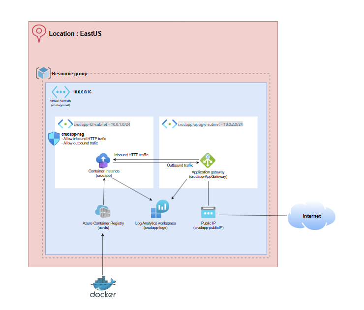

# Assignment2-Azure-IaC

This repository contains everything you need to deploy a fully functional CRUD app to Microsoft Azure using Infrastructure as Code. The setup is automated, allowing you to quickly deploy and run the app with minimal configuration. 

## Project Overview

This project demonstrates how to deploy a Dockerized CRUD application to Azure using Azure Container Registry (ACR) and Azure Container Instances (ACI). It leverages Bicep templates for infrastructure provisioning and a Bash script to automate the entire deployment process.

### Key Components

- **Dockerfile**: Defines the environment and dependencies for the CRUD application, creating a Docker image that is used for deployment.
- **acr.bicep**: Bicep template that provisions an Azure Container Registry (ACR) to store the Docker image.
- **aci.bicep**: Bicep template that provisions an Azure Container Instance (ACI), along with an Application Gateway, Network Security Groups, Subnets, and a Public IP.
- **deployment.sh**: A Bash script that automates the entire deployment process, executing the necessary Bicep deployments and Azure configurations.
- **Design Diagram.png**: A Design is a very important component of a project.

## Design Diagram



## Prerequisites

Before you begin, ensure you have the following prerequisites:

1. **Azure CLI** installed on your machine. [Install Azure CLI](https://learn.microsoft.com/en-us/cli/azure/install-azure-cli).
2. **Git** installed on your machine. [Install Git](https://git-scm.com/book/en/v2/Getting-Started-Installing-Git).
3. **Docker** installed to build and manage containers. [Install Docker](https://docs.docker.com/get-docker/).

## Deployment Steps

Follow these steps to deploy your CRUD app to Azure:

### 1. Clone the Repository

Clone this repository to your local machine using the following command:

```bash
git clone https://github.com/snijderd/Assignment2-Azure-IaC.git
```

### 2. Log Into Your Azure Account

Use the Azure CLI to log into your Azure account:

```bash
az login
```

This will open a popup to select your account.

### 3. Execute the Deployment Script

Run the `deployment.sh` script to automatically set up the infrastructure and deploy the CRUD app:

```bash
./deployment.sh
```

### 4. Access the Application

Once the deployment is complete, navigate to the Azure Portal and follow these steps:

- Go to your **Resource Group** created by the deployment script.
- Find the **Public IP** under the resources.
- Click on the **Public IP** to access your running CRUD application in the browser.

### 5. Enjoy!

Your CRUD app is now live on Azure! You can now interact with it through the public IP provided.

---

## Detailed Descriptions

### Dockerfile

The `Dockerfile` is used to build a Docker image for the CRUD application. This file installs the necessary dependencies and sets up the app environment, making it ready to run inside a container. 

### acr.bicep

The `acr.bicep` file provisions an **Azure Container Registry (ACR)** where the Docker image will be stored. This is a private registry that ensures the app’s Docker image is safely stored and accessible during deployment.

### aci.bicep

The `aci.bicep` file provisions several Azure resources required to run your application:
- **Azure Container Instance (ACI)**: Hosts the Docker container with your app.
- **Application Gateway**: Provides load balancing and manages incoming traffic to your application.
- **Network Security Groups (NSGs)**: Secures your application by controlling inbound and outbound traffic.
- **Subnets**: Configures network segmentation for better security and performance.
- **Public IP**: Exposes the application to the internet.

### deployment.sh

The `deployment.sh` script automates the deployment process. It does the following:
1. Deploys the `acr.bicep` template to create the ACR.
2. Deploys the `aci.bicep` template to provision the Azure resources.
3. Configures the required networking, security, and application settings.

---

## Customization

The `aci.bicep` file is highly customizable. At the top of the file, you’ll find several parameters that can be modified to fit your specific needs. For example, you can rename parameters or change values to match your deployment requirements.

---

## Conclusion

With this setup, you can quickly deploy a CRUD app to Azure with minimal manual configuration.